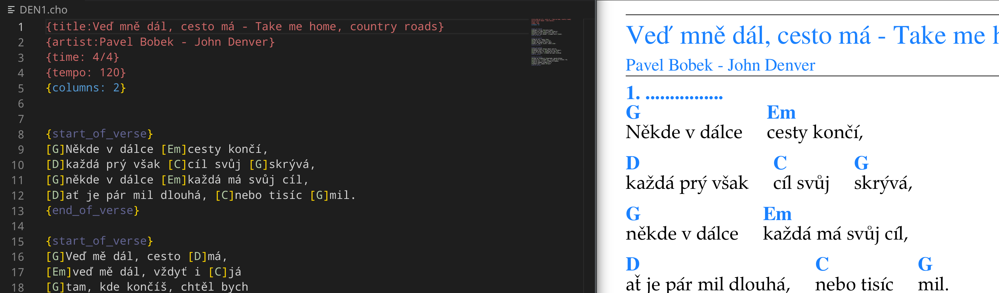

# Campfire - chordpro python

Simple songbook ,,typesetting'' ,,system'' rendering  chodpro files
> `python campfire.py ~/MySong.cho`



## Recommended ussage:
1) Run `python main.py mysong.cho` transforms to `mysong.pdf `
2) OPTIONAL - Grab Visual Studio code and install ChordPro extension to colorize `.cho` files

```
usage: campfire.py [-h] [--format FORMAT] [infile]

Process songbook.

positional arguments:
  infile

optional arguments:
  -h, --help       show this help message and exit
  --format FORMAT  [pdf] html
```

## Features:
* Real UTF8 support without any woodo-magic
* Produces nicely large printable pdfs which you can take to pub
* Keeping great support for KISS principe - just look for example `cho` file
* Multiplatform - using only python libraries without any native dependencies
* Great extensibility and modularity - write your own renderer
* **PDF** and HTML formats are supported
* Ligatures ;)

### Supported renderers
* PDF - Primary renderer
* HTML - ~~Aspiring to be primary renderer, but there is long way to go(page wrapping)~~ maybe for multiple songs

## Why another system?
* `lilypond` - perfect typesetting but doesn't work well simple songs
* `chordpro` is old and ... perl. Update: I'm not able to run version 6 on manjaro.
* `musescore` - typesetting is perfect, MIDI support is perfect, ... use this if you want more features
* `tex - packages` - overhelming complexity for single sheet with ~~poor~~ lack of UTF8 support 

# Developing & hacking

## Requirements - libs
```
pip install -r requirements.txt
```

## Planned features
* Keep it really simple
* Support for {style:A4L} and {style:A4} lanscape and normal A4

## Tests
```
python -m unittest discover -s tests
```

# Bugs
* Fonts cache is weird, delete `*.pkl` files
* Not working with pdf library 
```
self.fractionSymbols = {
    '4/4': '𝄴',
    '2/4': '𝄵'
}
```

(c) Pavel Prchal, 2020, 2021, 2023